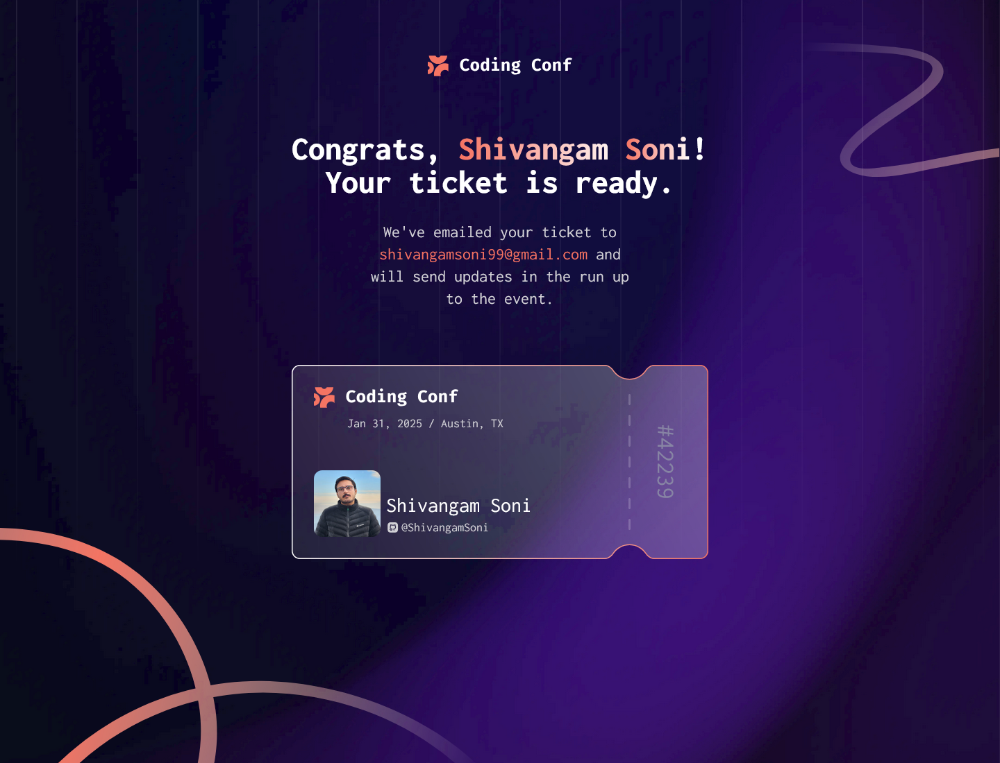

# Frontend Mentor - Conference ticket generator solution

This is a solution to the [Conference ticket generator challenge on Frontend Mentor](https://www.frontendmentor.io/challenges/conference-ticket-generator-oq5gFIU12w). Frontend Mentor challenge0s help you improve your coding skills by building realistic projects.

## Table of contents

-   [Overview](#overview)
    -   [The challenge](#the-challenge)
    -   [Screenshot](#screenshot)
    -   [Links](#links)
-   [My process](#my-process)
    -   [Built with](#built-with)
-   [Author](#author)

## Overview

### The challenge

Users should be able to:

-   Complete the form with their details
-   Receive form validation messages if:
    -   Any field is missed
    -   The email address is not formatted correctly
    -   The avatar upload is too big or the wrong image format
-   Complete the form only using their keyboard
-   Have inputs, form field hints, and error messages announced on their screen reader
-   See the generated conference ticket when they successfully submit the form
-   View the optimal layout for the interface depending on their device's screen size
-   See hover and focus states for all interactive elements on the page

### Screenshot

| Screenshots                           |
| ------------------------------------- |
|     |
|    |
|   |
|  |

### Links

-   [Live Demo](https://shivi-conference-ticket.netlify.app/)

## My process

### Built with

-   Semantic HTML5
-   TailwindCSS
-   TypeScript
-   React
-   React Hook Form
-   Zod

## Author

-   [Shivangam Soni](https://shivangam-soni.vercel.app/)
-   GitHub - [@ShivangamSoni](https://github.com/ShivangamSoni)
-   LinkedIn - [shivangam-soni](https://www.linkedin.com/in/shivangam-soni/)
-   Frontend Mentor -
    [@ShivangamSoni](https://www.frontendmentor.io/profile/ShivangamSoni)
-   CodePen - [ShivangamSoni](https://codepen.io/ShivangamSoni)
-   iCodeThis - [Shivangam_Soni](https://icodethis.com/Shivangam_Soni)
-   StackOverflow - [shivangam-soni](https://stackoverflow.com/users/16659219/shivangam-soni)
-   ORCiD - [Shivangam Soni](https://orcid.org/0009-0002-3449-817X)
-   Instagram - [shivangam_soni](https://www.instagram.com/shivangam_soni/)
-   X - [ShivangamSoni](https://x.com/ShivangamSoni)
-   Threads - [@shivangam_soni](https://www.threads.net/@shivangam_soni)
